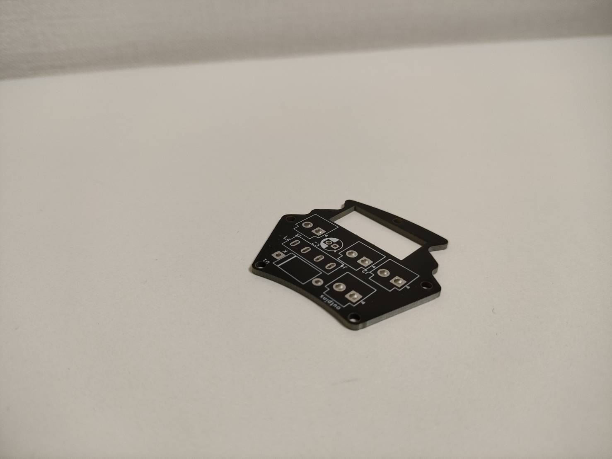

# 基板発注はじめました
 

 

どうも宗高グラジオラス設計、回路設計担当のPandaです。 
今回は、基板発注についての記事、第一弾です。 
今年の7/30に”よし、基板を発注してみよう”と思ったのがきっかけで、JLCPCBさんとの交渉の結果、スポンサーになってくださることになりました。 
JLCPCBさん、学生であり金銭面にもいろいろな問題がある中、ご賛同、まだ未熟な私たちにご協力していただき、ありがとうございます。 
ここからは実際に基板を発注してみて、感想などを書いていこうと思います。 
8/22に初めてJLCPCBさんに黒色の基板、表面実装あり、配達業者はDHLさんで発注してみると、なんと8日で届きました！ 
基板のチェックもしてくださり、基板の問題点などは丁寧に対応してくれました。 
箱に傷もなく、さすがDHLさんと思いました。 
開けてみるとこんな感じでした。 
基板の動作チェックをしても、僕のミス以外完璧でした。 
ちなみに今回発注した基板はmain board,battery board,line senserが三種類といった内容です。 

 

 

 

 